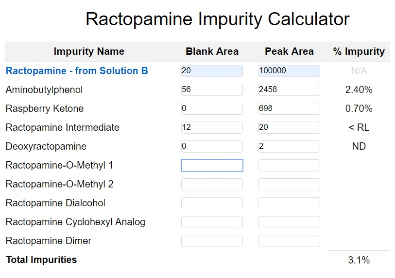

# Impurity Calculator
## A JavaScript app that calculates chemical impurities based on the user’s input.
**App Link:** https://impurity-calculator.herokuapp.com/index.html

**Summary:** This app takes input from a lab analyst (the intended app user) in the form of impurity peak areas, performs calculations on it, and reports the results as a number or text (e.g., percentage to 2 decimal places, ‘not detected’ or ‘less than reporting limit’) depending on the value of the result. It also displays the total impurities after filtering out numbers that are less than the reporting limit.

**Screenshot of app in use:**

**Notes and rules for the calculations:**
1. Aminobutylphenol, Raspberry Ketone (listed in regular black text in the app) are impurities.
2. For each impurity, a % Impurity is calculated as follows: **% Impurity = (Corrected peak area of the impurity/Corrected peak area of Ractopamine in Solution B) x 100%**, where, **corrected peak area = peak area - blank peak area**.
3. The user must press 'tab' or 'return' after entering a number in any cell to return its value.
4. Presently, the app is only able to perform the % Impurity calculation when 'tab' or 'enter' is pressed on any of the impurity's peak area cell. No impurity calculations are required for 'Ractopamine - from Solution B' (formatted in blue in the app) as it is only a reference in the calculations and not an impurity.
5. The results of the % Impurities are displayed as follows:
* Zero or negative: "ND" (not detected)
* Between 0% and 0.09%: "< RL" (less than reporting limit)
* Above 0.09%: the calculated % is reported to 2 decimal places
6. The sum of the % Impurities are displayed in the 'Total Impurities' cell as they are calculated, only if they are above 0.09%. The result is shown to 1 decimal place.

**Future Work:**

Ideally, the app will:
1. Perform the above calculations on several lots at a time. The impurities currently listed in the app (Aminobutylphenol, Raspberry Ketone, etc.) are for one product lot. In reality, multiple lots will have to be analysed and the results stored somewhere.
2. Higlight any out-of-specification results.
3. Reperform calculations upon hitting 'tab' or 'enter' on the reference (i.e., Ractopamine - from Solution B) or blank area cells.
4. Be built using better, DRY code and incorporate ES 6-9.
